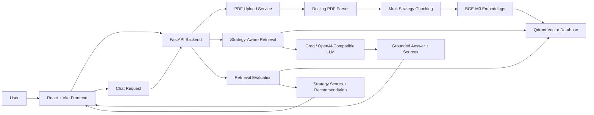

# Document Intelligence RAG Platform

A production-oriented Retrieval-Augmented Generation (RAG) web application for uploading PDF documents, parsing structured content, comparing chunking strategies, indexing document chunks into a vector database, and chatting with documents using source-grounded answers.

The project is designed to show not only that a PDF-chat system works, but also **how retrieval quality is evaluated and how chunking decisions are selected based on measurable evidence**.

---

## Project Summary

This application allows users to upload one or more PDF files and ask natural-language questions about them. The backend parses the documents, creates multiple chunking variants, embeds the chunks, stores them in Qdrant, retrieves relevant chunks for each question, and generates grounded answers with source information.

The system also includes a built-in evaluation workflow using hard-coded test questions, expected keywords, retrieval scores, pass rate, and an overall strategy recommendation. This makes the RAG pipeline transparent and measurable instead of treating retrieval as a black box.

---

## Key Features

- Multi-PDF upload
- Structured PDF parsing with Docling
- Multiple chunking strategies:
  - `recursive`
  - `section_aware`
  - `table_preserving`
  - `parent_child`
- BGE-M3 embedding generation
- Qdrant vector database indexing and retrieval
- Document chat with user and assistant message bubbles
- Source-grounded answers with retrieved chunks
- OpenAI-compatible LLM provider support, including Groq
- Extractive fallback mode when no LLM key is configured
- Retrieval strategy evaluation with hard-coded test questions
- Strategy comparison and best-strategy recommendation
- React + Vite frontend dashboard
- FastAPI backend
- Docker Compose full-stack setup

---

## Tech Stack

| Layer | Technology |
|---|---|
| Frontend | React, TypeScript, Vite |
| Backend | FastAPI, Python |
| PDF Parsing | Docling |
| Embeddings | BGE-M3 |
| Vector Database | Qdrant |
| LLM Provider | OpenAI-compatible API, Groq-compatible configuration |
| Containerization | Docker, Docker Compose |
| Evaluation | Custom retrieval evaluation with expected keywords, recall, pass rate, top score, and overall score |

---

## Architecture



---

## Repository Structure

```text
document-intelligence-rag-platform/
│
├── backend/
│   ├── app/
│   │   ├── api/
│   │   │   ├── chat.py
│   │   │   ├── documents.py
│   │   │   ├── evaluation.py
│   │   │   └── search.py
│   │   ├── core/
│   │   │   └── config.py
│   │   ├── schemas/
│   │   │   └── document.py
│   │   ├── services/
│   │   │   ├── chunking_service.py
│   │   │   ├── embeddings.py
│   │   │   ├── evaluation_testset.py
│   │   │   ├── vector_store.py
│   │   │   ├── parsing/
│   │   │   │   └── docling_parser.py
│   │   │   └── llm/
│   │   │       ├── base.py
│   │   │       ├── extractive_provider.py
│   │   │       ├── factory.py
│   │   │       └── openai_compatible_provider.py
│   │   └── main.py
│   ├── storage/
│   │   ├── uploads/
│   │   ├── parsed/
│   │   ├── chunks/
│   │   └── embeddings/
│   ├── Dockerfile
│   ├── .dockerignore
│   ├── .env.example
│   └── requirements.txt
│
├── frontend/
│   ├── src/
│   │   ├── api.ts
│   │   ├── App.tsx
│   │   ├── App.css
│   │   └── index.css
│   ├── Dockerfile
│   ├── nginx.conf
│   ├── .dockerignore
│   ├── .env.example
│   └── package.json
│
├── docs/
│   └── screenshots/
├── docker-compose.yml
├── .gitignore
└── README.md
```

---

## Quick Start with Docker

### 1. Create backend environment file

```powershell
copy backend\.env.example backend\.env
```

Edit:

```text
backend/.env
```

Add your own API key:

```env
OPENAI_COMPATIBLE_BASE_URL=https://api.groq.com/openai/v1
OPENAI_COMPATIBLE_API_KEY=your_key_here
OPENAI_COMPATIBLE_MODEL=llama-3.1-8b-instant
```

### 2. Start full stack

```powershell
docker compose up --build
```

This starts:

- Qdrant vector database
- FastAPI backend
- React/Vite frontend served through NGINX

### 3. Open services

Frontend:

```text
http://localhost:5173
```

Backend API docs:

```text
http://localhost:8000/docs
```

Qdrant dashboard:

```text
http://localhost:6333/dashboard
```

### 4. Stop services

```powershell
docker compose down
```

To run in background:

```powershell
docker compose up -d --build
```

To view logs:

```powershell
docker compose logs -f
```

---

## Local Development Setup

Use this if you want to run backend and frontend separately during development.

### 1. Start Qdrant

```powershell
docker compose up -d qdrant
```

### 2. Start Backend

```powershell
cd backend
python -m venv .venv
.\.venv\Scripts\activate
pip install -r requirements.txt
copy .env.example .env
uvicorn app.main:app --reload
```

Backend runs at:

```text
http://127.0.0.1:8000
```

API docs:

```text
http://127.0.0.1:8000/docs
```

### 3. Start Frontend

```powershell
cd frontend
npm install
copy .env.example .env
npm run dev
```

Frontend runs at:

```text
http://localhost:5173
```

---

## Environment Variables

### Backend

`backend/.env.example`

```env
APP_NAME=Document Intelligence RAG Platform

QDRANT_URL=http://localhost:6333
QDRANT_COLLECTION_NAME=document_chunks

EMBEDDING_MODEL_NAME=BAAI/bge-m3
EMBEDDING_BATCH_SIZE=8
NORMALIZE_EMBEDDINGS=true

OPENAI_COMPATIBLE_BASE_URL=https://api.groq.com/openai/v1
OPENAI_COMPATIBLE_API_KEY=replace_with_your_key
OPENAI_COMPATIBLE_MODEL=llama-3.1-8b-instant
```

### Frontend

`frontend/.env.example`

```env
VITE_API_BASE_URL=http://127.0.0.1:8000/api
```

Do not put API keys in the frontend environment file. Vite exposes client-side environment variables to the browser bundle.

---

## API Overview

### Health Check

```http
GET /health
```

### Upload Documents

```http
POST /api/documents/upload
```

Uploads one or more PDF files, parses them, chunks them with multiple strategies, embeds chunks, and indexes them into Qdrant.

### List Indexed Documents

```http
GET /api/documents
```

Returns indexed documents available in the vector database.

### Search

```http
POST /api/search
```

Runs retrieval against indexed chunks.

Example request:

```json
{
  "query": "What evaluation methods are discussed?",
  "strategy": "section_aware",
  "limit": 5
}
```

### Chat

```http
POST /api/chat
```

Generates a grounded answer using retrieved document chunks.

Example request:

```json
{
  "question": "What evaluation methods are discussed?",
  "strategy": "section_aware",
  "provider": "compatible",
  "limit": 5
}
```

Supported providers:

```text
compatible
extractive
```

### Evaluation

```http
POST /api/evaluation/run
```

Runs the hard-coded evaluation test set across selected chunking strategies.

Example request:

```json
{
  "document_id": null,
  "strategies": [
    "recursive",
    "section_aware",
    "table_preserving",
    "parent_child"
  ],
  "limit": 5
}
```

---

## Chunking Strategies

### Recursive

General-purpose chunking strategy that splits text into manageable semantic blocks using chunk size and overlap.

Best suited for:

- plain text PDFs
- continuous prose
- simple reports
- documents without strong structural layout

### Section-Aware

Uses document structure and headings to preserve semantic sections.

Best suited for:

- academic papers
- reports with headings
- structured documents
- documents where sections are meaningful retrieval units

### Table-Preserving

Keeps table-like content together instead of splitting it into disconnected fragments.

Best suited for:

- PDFs with tabular data
- comparison tables
- metric-heavy reports
- documents where table rows and columns must stay together

### Parent-Child

Creates larger parent chunks and smaller child chunks. Retrieval can use smaller chunks while preserving broader parent context.

Best suited for:

- dense technical documents
- long explanations
- cases where local evidence needs surrounding context
- reducing answer fragmentation

---

## Retrieval and Evaluation Design

The project evaluates retrieval quality using five hard-coded test questions with expected answers and expected keywords. For each chunking strategy, the system computes:

- keyword recall
- top retrieval score
- pass/fail per question
- pass rate
- overall score
- strengths
- weaknesses
- recommendation
- best strategy selection

The goal is not to claim that one strategy is universally best. Instead, the system demonstrates a professional evaluation pattern:

```text
parse -> chunk using multiple strategies -> embed -> retrieve -> evaluate -> select best strategy for the document
```

This makes the RAG pipeline explainable and measurable.

---

## Engineering Decisions

### Why Docling for Parsing?

Plain PDF text extraction often loses structure, tables, and layout information. This project uses a document-intelligence parser so that the pipeline can handle more than only basic text PDFs.

### Why Multiple Chunking Strategies?

Different PDF types require different chunking decisions. A strategy that works for simple prose may fail for tables or section-heavy documents. The system creates multiple chunking variants and evaluates them instead of assuming one universal approach.

### Why BGE-M3 Embeddings?

BGE-M3 is used as a strong general-purpose embedding model for semantic retrieval across different query styles and document structures.

### Why Qdrant?

Qdrant provides persistent vector storage, metadata-based filtering, Docker-friendly deployment, and efficient vector search. This is more realistic than keeping embeddings only in memory.

### Why OpenAI-Compatible Provider?

The LLM interface is provider-agnostic. Any OpenAI-compatible provider can be configured through environment variables. This keeps the project flexible and avoids hard-coding one vendor.

### Why Evaluation in the UI?

RAG quality should not be hidden in backend logs. The UI exposes retrieval evaluation results so users can see which chunking strategy performs best for the uploaded document.

---

## Screenshots

Create the following screenshots after running the project and place them in:

```text
docs/screenshots/
```

Recommended files:

```text
docs/screenshots/dashboard.png
docs/screenshots/chat_sources.png
docs/screenshots/evaluation.png
```

Then this section will render correctly on GitHub.

### Dashboard


### Chat with Sources


### Retrieval Evaluation


---

## Running Tests and Validation

### Backend syntax check

```powershell
cd backend
.\.venv\Scripts\activate

python -m py_compile app\main.py
python -m py_compile app\api\documents.py
python -m py_compile app\api\chat.py
python -m py_compile app\api\evaluation.py
python -m py_compile app\services\vector_store.py
```

### Frontend production build

```powershell
cd frontend
npm run build
```

### Docker validation

```powershell
docker compose up --build
docker compose ps
docker compose logs -f
```

---

## Security Notes

- Never commit `backend/.env`.
- Never commit API keys.
- Rotate keys immediately if they are accidentally exposed.
- Keep generated PDF uploads and parsed/chunked outputs out of Git.
- Use `.env.example` files to document configuration without exposing secrets.

Recommended ignored paths:

```gitignore
.env
.env.local
backend/.env
frontend/.env

.venv/
backend/.venv/
__pycache__/
*.pyc

node_modules/
frontend/node_modules/
dist/
frontend/dist/

backend/storage/uploads/*
backend/storage/parsed/*
backend/storage/chunks/*
backend/storage/embeddings/*
```

---

## Troubleshooting

### Docker Desktop is not running

If Docker says it cannot connect to the Docker API, start Docker Desktop and wait until the engine is running.

### Backend cannot connect to Qdrant in Docker

Inside Docker Compose, the backend must use:

```env
QDRANT_URL=http://qdrant:6333
```

not:

```env
QDRANT_URL=http://localhost:6333
```

`localhost` inside a container refers to the container itself.

### Groq / OpenAI-compatible provider says API key is missing

Check:

```text
backend/.env
```

Make sure it contains:

```env
OPENAI_COMPATIBLE_API_KEY=your_real_key
```

Then restart the backend.

### Frontend cannot reach backend

For local development, check:

```env
VITE_API_BASE_URL=http://127.0.0.1:8000/api
```

For Docker/NGINX, the frontend should use:

```env
VITE_API_BASE_URL=/api
```

### Old containers are still running

Check:

```powershell
docker compose ps
docker ps -a
```

Stop and remove the stack:

```powershell
docker compose down
```

Remove old duplicate containers only if needed:

```powershell
docker rm <container_name>
```

---

## Suggested Demo Flow

Use this sequence when presenting the project:

1. Start the full stack with Docker.
2. Open the frontend dashboard.
3. Upload a PDF.
4. Ask a document-level question.
5. Show the assistant answer bubble.
6. Expand retrieved source cards.
7. Switch chunking strategy.
8. Ask another question.
9. Run strategy evaluation.
10. Explain why the best strategy was selected.
11. Open FastAPI docs to show backend API structure.
12. Open Qdrant dashboard to show vector database infrastructure.

---

## Current Limitations

- Evaluation uses a fixed test set and keyword-based scoring, not a full human or LLM-as-judge evaluation.
- OCR quality depends on parser/model support and document quality.
- Very large PDFs may require batching and background processing for production use.
- Chat history is frontend-session based and not stored in a database.
- Authentication and user-level document isolation are not implemented yet.
- Deployment requires secure environment variable management.

---

## Future Improvements

- Add background job queue for long-running PDF ingestion.
- Add per-document evaluation test set generation.
- Add reranking after vector retrieval.
- Add hybrid search combining dense retrieval and keyword search.
- Add LLM-as-judge evaluation for groundedness and answer correctness.
- Add user authentication and document ownership.
- Add persistent chat sessions.
- Add streaming responses.
- Add deployment configuration for Render, Railway, Fly.io, or a VPS.
- Add CI pipeline for backend and frontend validation.

---

## License

This project is intended for educational and portfolio use. Add a license file before using it in a public or commercial setting.


## Evaluation Setup

The platform evaluates different retrieval configurations by running the same benchmark questions across multiple chunking strategies and top-k values. The goal is to identify which strategy gives the best balance between retrieval quality, groundedness, citation accuracy, and latency.

| Component | Configuration |
|---|---|
| Evaluation mode | Full RAG evaluation |
| Evaluated strategies | `section_aware`, `recursive`, `parent_child`, `table_preserving` |
| Top-k values | `3`, `5` |
| Number of benchmark questions | 10 |
| Total evaluation runs | 80 full `/api/chat` calls |
| Metrics tracked | Overall score, retrieval score, groundedness, citation accuracy, latency |
| Best current configuration | `section_aware`, `top_k=3` |


## RAG Evaluation Results

The platform evaluates multiple retrieval configurations by running the same benchmark questions across different chunking strategies and top-k values. Each configuration is scored using retrieval accuracy, groundedness, citation accuracy, latency, and an overall weighted score.

| Strategy | Top-k | Overall | Retrieval | Groundedness | Citation | Latency ms |
|---|---:|---:|---:|---:|---:|---:|
| `section_aware` | 3 | 0.7265 | 0.80 | 0.85 | 0.80 | 706.47 |
| `section_aware` | 5 | 0.7145 | 0.80 | 0.90 | 0.80 | 1351.356 |
| `parent_child` | 5 | 0.7080 | 0.80 | 0.95 | 0.80 | 8534.32 |
| `parent_child` | 3 | 0.6544 | 0.60 | 1.00 | 0.60 | 6139.296 |
| `recursive` | 3 | 0.6192 | 0.80 | 0.6215 | 0.80 | 9478.928 |
| `table_preserving` | 3 | 0.6007 | 0.80 | 0.5733 | 0.80 | 9471.08 |
| `table_preserving` | 5 | 0.5998 | 0.80 | 0.6422 | 0.80 | 14004.92 |
| `recursive` | 5 | 0.5833 | 0.80 | 0.5667 | 0.80 | 13795.266 |


## Top-k Decision

| Strategy | Top-k=3 Result | Top-k=5 Result | Decision |
|---|---|---|---|
| `section_aware` | Overall `0.7265`, latency `706 ms` | Overall `0.7145`, latency `1351 ms` | Use `top_k=3`; better overall and faster |
| `parent_child` | Overall `0.6544`, latency `6139 ms` | Overall `0.7080`, latency `8534 ms` | `top_k=5` improves quality but is too slow for default chat |
| `recursive` | Overall `0.6192`, latency `9479 ms` | Overall `0.5833`, latency `13795 ms` | Use only as fallback for weakly structured documents |
| `table_preserving` | Overall `0.6007`, latency `9471 ms` | Overall `0.5998`, latency `14005 ms` | Useful for table-heavy documents, not default for this document |


## Evaluation Metrics

| Metric | Meaning | Why It Matters |
|---|---|---|
| Overall | Weighted score combining retrieval, groundedness, citation accuracy, answer similarity, and latency | Used to select the best practical configuration |
| Retrieval | Whether the expected source was retrieved | Measures retriever effectiveness |
| Groundedness | Whether the generated answer is supported by retrieved context | Helps detect hallucination or unsupported claims |
| Citation | Whether the returned answer cites the expected document/page/section | Important for trustworthy document-grounded answers |
| Latency ms | Average `/api/chat` response time in milliseconds | Ensures the configuration is usable in an interactive app |


## Selected Default Retrieval Configuration

| Decision Area | Selected Value | Reason |
|---|---|---|
| Default strategy | `section_aware` | Highest overall score in the benchmark |
| Default top-k | `3` | Best balance between quality and latency |
| Fallback strategy | `recursive` | Useful when documents have weak heading structure |
| Table-heavy fallback | `table_preserving` | Preserves tabular content when tables are detected |
| Long structured document fallback | `parent_child` | Provides broader context but increases latency |
| Full evaluation | On demand | Avoids slowing down the normal upload-to-chat flow |
