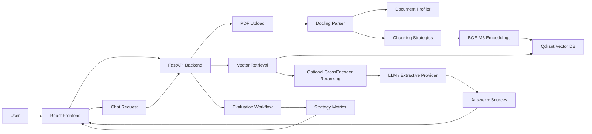
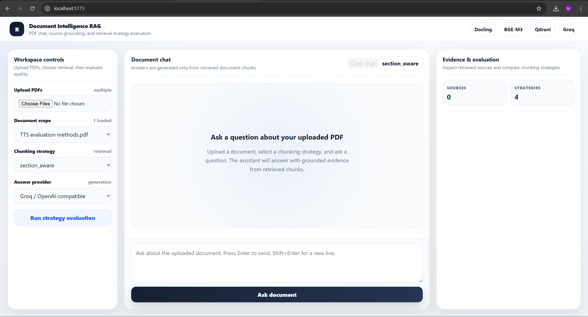
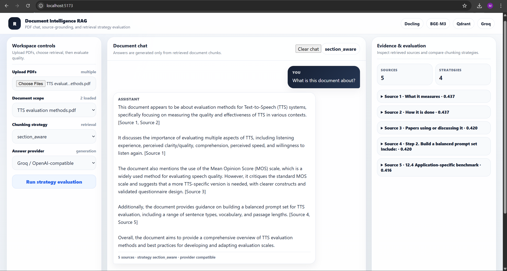
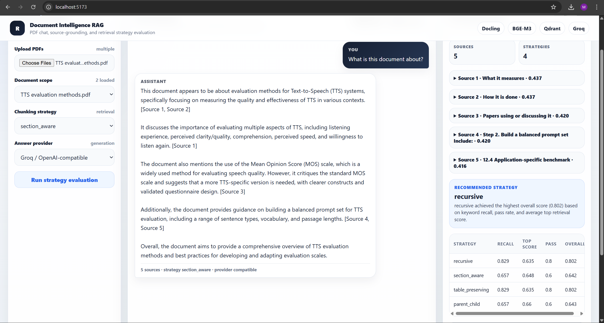

# Document Intelligence RAG Platform

A full-stack Retrieval-Augmented Generation (RAG) application for uploading PDFs, indexing document content, chatting with source-grounded answers, and evaluating retrieval quality across chunking strategies.

The project is built to demonstrate more than a basic PDF chatbot. It shows how document parsing, chunking, embedding, retrieval, reranking, citation, and evaluation decisions affect answer quality.

---

## Highlights

- Upload one or more PDF documents simultaneously.
- Parse structured PDF content with Docling.
- Generate embeddings with `BAAI/bge-m3`.
- Store and retrieve chunks with Qdrant vector database.
- Chat with uploaded documents through a React interface.
- Return answers with document name, page number, section title, chunk text, similarity score, and reranking metadata.
- Evaluate retrieval quality using hard-coded benchmark questions and expected answers.
- Compare chunking strategies and top-k settings using measurable scores.
- Use a document-aware retrieval policy for default strategy selection.
- Optionally rerank retrieved chunks before the LLM call.
- Run the full stack with Docker Compose.

---

## Tech Stack

| Layer | Technology |
|---|---|
| Frontend | React, TypeScript, Vite |
| Backend | FastAPI, Python |
| PDF parsing | Docling |
| Embeddings | BGE-M3 |
| Vector database | Qdrant |
| Retrieval | Dense vector search with metadata filtering |
| Reranking | SentenceTransformers CrossEncoder |
| LLM provider | OpenAI-compatible API, Groq-compatible configuration, extractive fallback |
| Evaluation | Custom retrieval and RAG evaluation scripts |
| Runtime | Docker Compose |

---

## System Architecture


---

## Screenshots

### Document Upload and Retrieval Policy



### Chat with Source-Grounded Answer



### Retrieval Evaluation Dashboard




---
---

## Core Workflow

```text
Upload PDF
→ Parse document
→ Profile document structure
→ Generate multiple chunking variants
→ Embed chunks
→ Store chunks in Qdrant
→ Select retrieval policy
→ Retrieve relevant chunks for each question
→ Optionally rerank retrieved chunks
→ Generate source-grounded answer
→ Display answer, sources, and evaluation metrics
```

---

## Running the Project

### Option 1: One-command local start

Use this when running the application locally on Windows.

```powershell
.\start-local.ps1
```

The script starts the Docker Compose stack, waits for services, and opens the frontend automatically.

Stop everything with:

```powershell
.\stop-local.ps1
```

### Option 2: Direct Docker Compose

```powershell
docker compose up --build
```

Open:

| Service | URL |
|---|---|
| Frontend | http://localhost:5173 |
| Backend API docs | http://localhost:8000/docs |
| Qdrant dashboard | http://localhost:6333/dashboard |

Stop the stack:

```powershell
docker compose down
```

Run in background:

```powershell
docker compose up -d --build
```

View logs:

```powershell
docker compose logs -f
```

---

## Environment Configuration

Create the backend environment file:

```powershell
copy backend\.env.example backend\.env
```

Example backend configuration:

```env
APP_NAME=Document Intelligence RAG Platform

QDRANT_URL=http://qdrant:6333
QDRANT_COLLECTION_NAME=document_chunks

EMBEDDING_MODEL_NAME=BAAI/bge-m3
EMBEDDING_BATCH_SIZE=8
NORMALIZE_EMBEDDINGS=true

OPENAI_COMPATIBLE_BASE_URL=https://api.groq.com/openai/v1
OPENAI_COMPATIBLE_API_KEY=your_api_key_here
OPENAI_COMPATIBLE_MODEL=llama-3.1-8b-instant

ENABLE_RERANKING=true
RERANKER_MODEL=cross-encoder/ms-marco-MiniLM-L-6-v2
RERANKER_CANDIDATE_LIMIT=12
RERANKER_FINAL_TOP_K=3
```


## API Overview

| Endpoint | Purpose |
|---|---|
| `GET /health` | Backend health check |
| `POST /api/documents/upload` | Upload, parse, chunk, embed, and index PDFs |
| `GET /api/documents` | List indexed documents |
| `POST /api/search` | Run retrieval against indexed chunks |
| `POST /api/chat` | Generate an answer from retrieved context |
| `POST /api/evaluation/run` | Run retrieval evaluation across strategies |

Example chat request:

```json
{
  "question": "What does Mean Opinion Score measure in TTS evaluation?",
  "document_id": "<document_id>",
  "strategy": "auto",
  "provider": "compatible",
  "limit": 3,
  "rerank": true,
  "rerank_candidate_limit": 12
}
```

---

## Retrieval Design

The platform does not use a single fixed retrieval setup for every PDF. During ingestion, each document is parsed, profiled, and indexed using multiple chunking strategies.

| Strategy | Purpose | Best suited for |
|---|---|---|
| `section_aware` | Preserves heading-based sections | Structured reports, papers, documentation |
| `recursive` | Splits text by size and overlap | General prose and weakly structured PDFs |
| `table_preserving` | Keeps table-like content together | Metric-heavy or tabular documents |
| `parent_child` | Retrieves focused child chunks with broader parent context | Dense technical documents and long explanations |

The default retrieval policy is selected from document structure signals such as page count, heading density, table density, and chunk statistics. Full evaluation is available as an explicit diagnostic workflow rather than blocking upload or chat.

---

## Reranking

The application includes optional second-stage reranking.

```text
Qdrant retrieves candidate chunks
→ CrossEncoder scores question-chunk pairs
→ chunks are sorted by rerank score
→ final top-k chunks are sent to the LLM
```

This improves precision when dense vector search returns semantically related chunks that are not the best direct evidence for the question. The UI shows both retrieval similarity and reranking metadata:

- vector similarity score
- rerank score
- original retrieval rank
- final source order

Rerank scores are raw model relevance scores. They are not normalized percentages; higher score means stronger relevance.

---

## Evaluation

The project includes a hard-coded evaluation set with expected answers and source expectations. Evaluation is used to compare retrieval configurations and justify strategy selection.

| Component | Configuration |
|---|---|
| Evaluation mode | Full RAG evaluation |
| Evaluated strategies | `section_aware`, `recursive`, `parent_child`, `table_preserving` |
| Top-k values | `3`, `5` |
| Benchmark questions | 10 |
| Total evaluation calls | 80 `/api/chat` calls |
| Metrics | Overall, retrieval, groundedness, citation accuracy, latency |
| Best current configuration | `section_aware`, `top_k=3` |

### RAG Evaluation Results

| Strategy | Top-k | Overall | Retrieval | Groundedness | Citation | Latency ms |
|---|---:|---:|---:|---:|---:|---:|
| `section_aware` | 3 | 0.7265 | 0.80 | 0.85 | 0.80 | 706.47 |
| `section_aware` | 5 | 0.7145 | 0.80 | 0.90 | 0.80 | 1351.36 |
| `parent_child` | 5 | 0.7080 | 0.80 | 0.95 | 0.80 | 8534.32 |
| `parent_child` | 3 | 0.6544 | 0.60 | 1.00 | 0.60 | 6139.30 |
| `recursive` | 3 | 0.6192 | 0.80 | 0.6215 | 0.80 | 9478.93 |
| `table_preserving` | 3 | 0.6007 | 0.80 | 0.5733 | 0.80 | 9471.08 |
| `table_preserving` | 5 | 0.5998 | 0.80 | 0.6422 | 0.80 | 14004.92 |
| `recursive` | 5 | 0.5833 | 0.80 | 0.5667 | 0.80 | 13795.27 |

### Selected Retrieval Configuration

| Decision | Selected value | Reason |
|---|---|---|
| Default strategy | `section_aware` | Best overall benchmark result |
| Default top-k | `3` | Best quality-latency trade-off |
| Table-heavy fallback | `table_preserving` | Preserves tabular evidence |
| Weak-structure fallback | `recursive` | Robust when headings are limited |
| Long-document fallback | `parent_child` | Provides broader context when needed |
| Full evaluation | On demand | Avoids slowing normal upload and chat |

The result shows that the highest groundedness score is not always the best production choice. `parent_child` improves context coverage, but its latency is much higher. `section_aware + top_k=3` gives the best balance between accuracy, citations, and responsiveness.

---

## Why the Chunking Strategy Matters

Chunking directly controls what evidence the retriever can find. Poor chunking can split relevant context, lose section boundaries, or separate table rows from their headers. This project evaluates chunking strategies instead of assuming one strategy is universally correct.

The selected default, `section_aware`, works well for structured PDFs because it preserves topical boundaries and improves source-level citations. The evaluation results show that increasing `top_k` from 3 to 5 does not automatically improve the final system; it can increase latency and introduce less focused context.

---

## Source Attribution

Each answer includes retrieved evidence with:

- document name
- page number
- section title
- chunk index
- retrieval strategy
- similarity score
- rerank score when reranking is enabled
- original retrieval rank
- source text preview

This makes each answer inspectable and helps users verify whether the response is grounded in the uploaded document.

---

## Repository Structure

```text
document-intelligence-rag-platform/
├── backend/
│   ├── app/
│   │   ├── api/
│   │   ├── core/
│   │   ├── schemas/
│   │   ├── services/
│   │   └── main.py
│   ├── evaluation/
│   ├── data/
│   ├── Dockerfile
│   ├── requirements.txt
│   └── .env.example
├── frontend/
│   ├── src/
│   ├── Dockerfile
│   ├── package.json
│   └── .env.example
├── docker-compose.yml
├── start-local.ps1
├── stop-local.ps1
└── README.md
```

---

## Validation Commands

Backend syntax check:

```powershell
cd backend
python -m py_compile app\main.py
python -m py_compile app\api\documents.py
python -m py_compile app\api\chat.py
python -m py_compile app\api\evaluation.py
```

Frontend build:

```powershell
cd frontend
npm run build
```

Docker validation:

```powershell
docker compose up --build
docker compose ps
docker compose logs -f
```

Evaluation run:

```powershell
cd backend
python -m evaluation.run_eval
```

---

## Limitations

- Evaluation uses a fixed benchmark set and custom scoring.
- Chat history is kept in the frontend session and is not persisted.
- Follow-up question rewriting is not yet implemented.
- Authentication and user-level document isolation are not included.
- Very large PDFs may require background processing in a production deployment.
- Streaming responses are not implemented yet.

---

## Future Improvements

- Add streaming answer generation.
- Add hybrid dense and keyword retrieval.
- Add LLM-as-judge evaluation for groundedness and answer correctness.
- Add automatic evaluation-question generation per uploaded document.
- Add persistent chat sessions.
- Add user authentication and document ownership.
- Add deployment configuration for a public URL.
- Add CI checks for backend, frontend, and Docker builds.

---

## Demo Flow

1. Start the platform with `./start-local.ps1` or `docker compose up --build`.
2. Upload one or more PDFs.
3. Show the detected document profile and selected retrieval policy.
4. Ask a document question.
5. Expand the source cards and show page/section citations.
6. Enable reranking and compare source ordering.
7. Run retrieval evaluation.
8. Explain why `section_aware + top_k=3` is the default configuration.
9. Open FastAPI docs and Qdrant dashboard to show the backend infrastructure.


